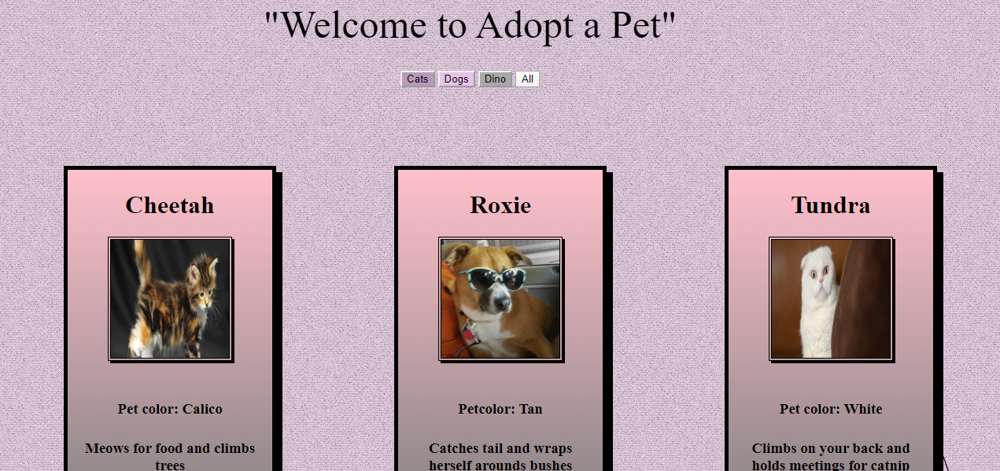

# pet-adoption 2

## Description -- 
This project we used flex box and played with css styling.   Users are able to filter thru pets with the buttons on top of the page.  

## Screen shots

## Instructions how to run
1.  Clone down the repo.
2. Make sure you have http - server installed via npm.  If not, get it [here](https://www.npmjs.com/package/http-server)
3. On your command line run `hs -p 9999`.
4.  Navigate to local host `http://localhost:9999`

